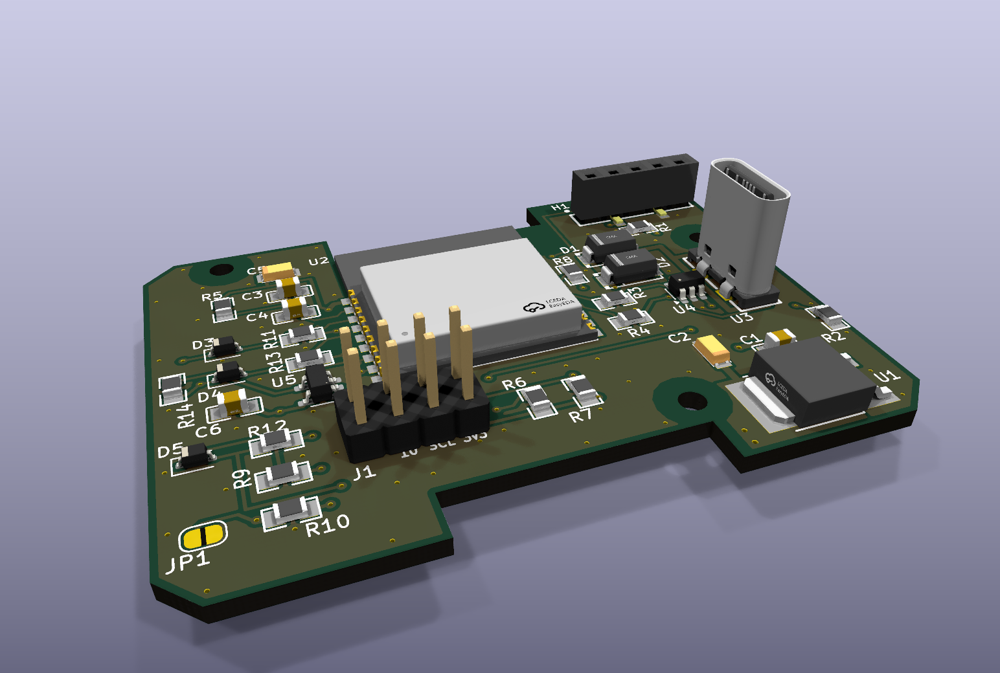
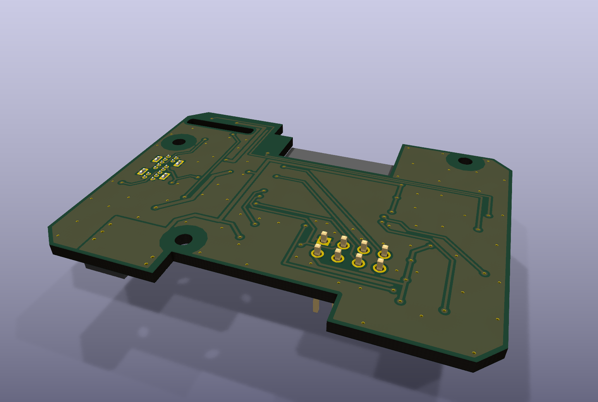
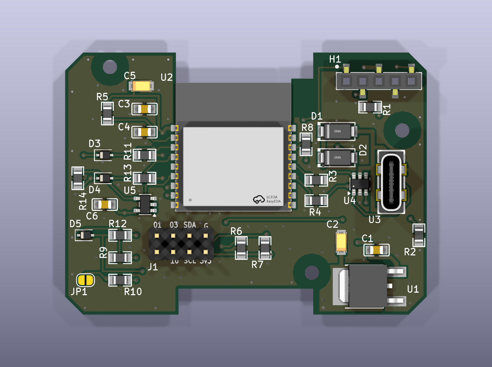
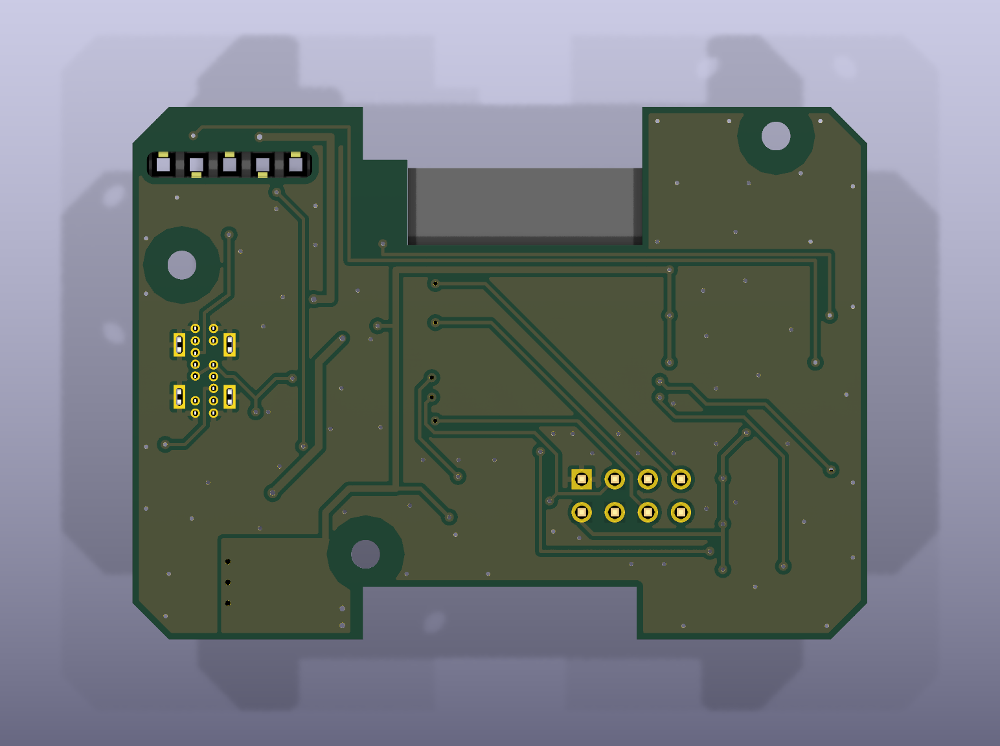

# heimdall-module

ESP32-C3 based module for the transmitter's JR module bay, part of the Heimdall Suite.

## Status

Hardware rev 2 (KiCad 10, `hardware/kicad/`): schematic reviewed and corrected,
board re-placed and re-routed from the first EasyEDA layout. Not built or tested
yet. The EasyEDA originals are kept in `hardware/easyeda-archive/`. No firmware yet.

KiCad 3D renders of rev 2:

| Top, angled | Bottom, angled |
|---|---|
|  |  |

| Top | Bottom (mirrored, as seen from below) |
|---|---|
|  |  |

## Case

The board is shaped for the 3D-printed case `MULTI-Module_Bangood_4-in-1_Case.stl`
(the STL is not in this repo). The figures below were measured from that STL:

- The outline is the case cavity (57 x 41.5 mm) minus 0.3 mm all round. It has
  notches for the two latch housings, which reach 4 mm in from the long walls.
  The top notch merges with the cut-out under the ESP32 module's antenna.
- The four corners are chamfered 45° (2.8 mm legs). The lid screw holes
  (1.7 mm) sit in 3.5 mm bosses in the cavity corners, from about 11 mm above
  the floor upwards. The board has to pass them on the way down to the
  standoffs, and the chamfers leave about 0.47 mm to each boss.
- MH1-MH3 are 2.2 mm holes for 2 mm self-tapping screws into the case's three
  standoffs (4.5 mm, 1.8 mm pilot holes, tops 5 mm above the floor).
  The lid uses the same screws. The copper keeps 3 mm clear of each hole.
- The bay pins come up through the floor opening and the H1 slot into the
  female header on top.
- **H1 position:** taken from three existing JR-bay designs. All three put the
  bay pins about 1.25 mm closer to the end wall than the centre of the case's
  floor opening:
  - DIY Multiprotocol STM32 v1.0t (Eagle)
  - Multiprotocol V2 (Gerbers)
  - ExpressLRS TX_SX1280 (Gerbers)

  This is not yet checked against a real radio.
- The case still needs an opening for the USB-C connector.

`case_place.py` moved the rev 2 parts into the case outline. `spread_place.py`
then spread them for hand soldering: at least 1 mm between courtyards left of the
module, and U1 moved down to the bottom edge. A few pairs on the USB side are
still closer. `route_pcb.py prep` draws the hand routes; Freerouting and the
later `route_pcb.py` steps do the rest.

## Pin assignment (rev 2)

| Function | ESP32-C3 GPIO | Via |
|---|---|---|
| Bay SIGNAL / PPM (H1 pin 1), input | IO4 | D3, R11 4.7k pull-up |
| Bay DATA / S.Port (H1 pin 5), receive | IO5 | D4, R13 4.7k pull-up |
| Bay DATA / S.Port (H1 pin 5), transmit | IO7 | U5 74LVC1G34 + R14 1k |
| Bay HB (H1 pin 2), output | IO8 | D5 (pull low only), R9 doubles as its pull-up |
| I2C SDA / SCL (J1, 10k pull-ups) | GPIO20 / GPIO21 (U0RXD / U0TXD) | |
| Breakout (J1) | IO1, IO3, IO10 | |
| USB D- / D+ | IO18 / IO19 | R4 / R3 33R |
| Strapping | IO2, IO8 (HB), IO9 pulled up 10k; JP1 BOOT bridges IO9 to GND | |

IO0 and IO6 are unused. UART0's pins carry I2C, so the console has to run over
USB-Serial/JTAG.

## Bay interface

The bay lines never connect straight to the ESP32.

- SIGNAL (PPM in) and DATA receive go through a BAT54WS Schottky with its
  cathode at the bay, the same scheme as the DIY Multiprotocol module (STM32
  board v1.0t, BAT48 diodes). The radio can only pull the line low; the high
  level comes from our 3V3 pull-ups (R11, R13), so a radio that drives 5 V
  never reaches the ESP32.
- HB (out) goes through a Schottky with its anode at the bay: the ESP32 can
  only pull it low, R12 (4.7k) pulls it high on the bay side.
- DATA transmit goes through U5, a 74LVC1G34 buffer (5.5 V tolerant, always on),
  and R14 (1k). The UART's idle level holds the line, so the same hardware
  works for CRSF (idle high) and inverted S.Port (idle low); which one is a
  firmware setting. When the radio transmits it overrides the 1k (about
  3.3 mA). Against a 10k pull-up on the radio side, an S.Port idle low sits at
  about 0.3 V (calculated, not measured).

DATA is half duplex on one wire, with separate receive and transmit pins
(IO5/IO7). The receive pin also sees the module's own transmitted bytes, so
firmware has to discard that echo. Inversion is done in the ESP32-C3's UART.
Use IO8 (HB) as an output only after boot: it is a strapping pin, which is
safe here because download mode needs USB, and USB and the bay can't be
connected at the same time.
